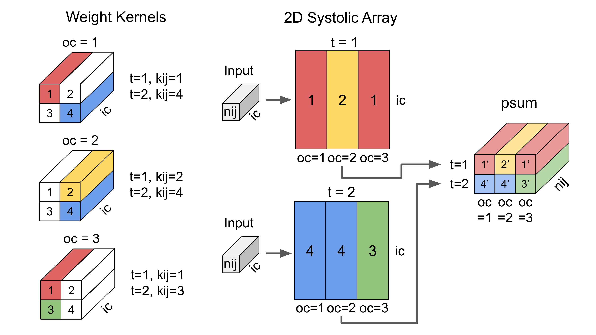
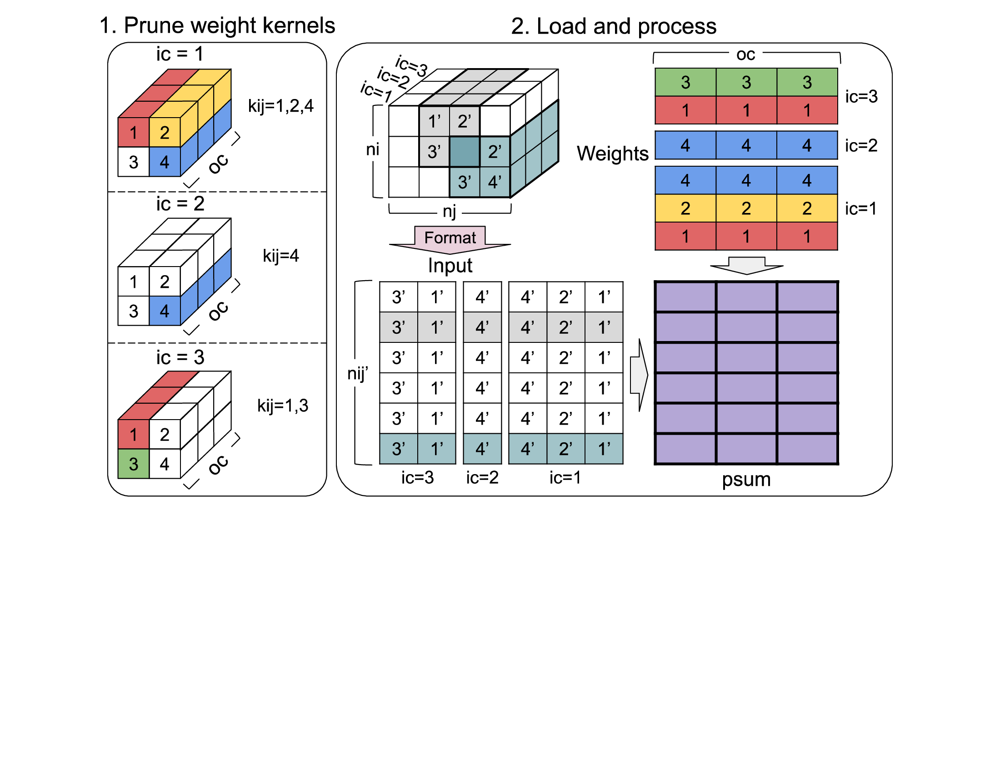

# Time-step Skipping Pruning and 4-bit Quantization for Systolic Arrays
PyTorch implementation of structured pruning for convolutional layers using "timestep skipping," followed by 4-bit quantization-aware training.

## Weight Stationary Architecture Pruning

For each output channel in the convolution layer, prune the weights at specific $$k_{ij}$$​ indices. These $$k_{ij}$$​​ indices represent the flattened positions within the weight kernel, derived from the spatial positions $$k_i$$​ and $$k_j$$​. For a pruning sparsity ratio $$P$$, and a weight kernel of dimensions $$l$$ (length) and $$w$$ (width), $$\lfloor P \cdot l \cdot w \rceil$$ indices are pruned per output channel. At each timestep, the unpruned $$k_{ij}$$​ index weights are loaded onto the systolic array for processing for each output channel.

## Output Stationary Architecture Pruning

## Results
The results were obtained using a **14M** parameter VGG16 model, which achieved 90.98% accuracy on CIFAR-10 when trained from scratch with the AdamW optimizer. The table below summarizes the test accuracy after pruning **80%** of the convolutional layer weights, applying 4-bit quantization-aware training (QAT), and the resulting error delta compared to the original full-precision model. Pruning was performed iteratively during training using a scheduler to optimize the weight reduction process.
| Type           | WS Test Accuracy | OS Test Accuracy |
| -------------- | ---------------: | ---------------: |
| Full           | *90.98%*         | *90.98%*         |
| Pruned         | 90.77%           | 89.32%           |
| Pruned + QAT   | 90.79%           | 88.28%           |
| Error Delta    | **-0.19%**       | **-2.70%**       |

## Benefits
Pruning reduces the processing requirements and model size by approximately a factor of $$1/(1−S)$$, where $$0 \leq S \lt 1$$ represents sparsity. OS pruning enables finer-grained sparsity by allowing each input channel to prune any number of $$k_{ij}$$ positions, offering greater flexibility compared to WS pruning.

## Further Research
Fine-grained WS pruning could be achieved by allowing a variable number of output channels' psum blocks to be computed at each timestep. However, this approach is incompatible with the parallel accumulation performed by the special function units in the current simple systolic array design. Future research should focus on addressing the challenge of fast accumulation to enable finer-grained WS pruning.
