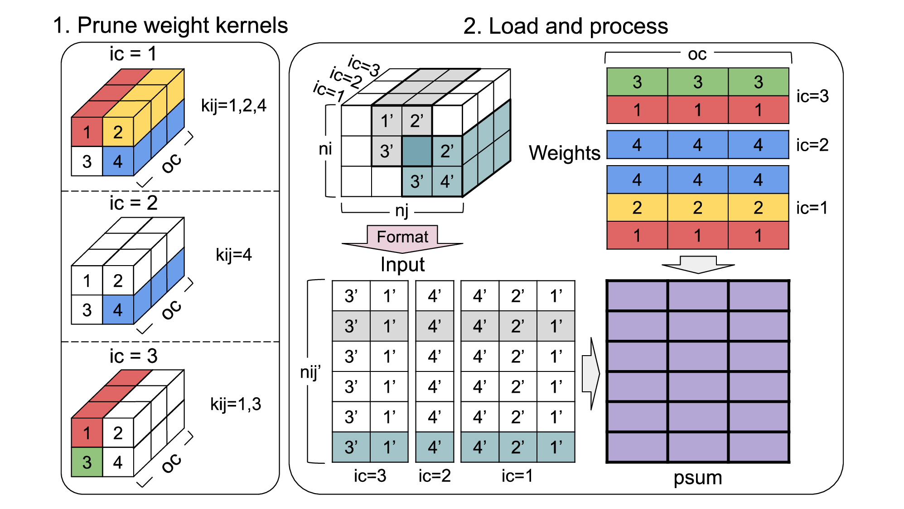

# Time-step Skipping Pruning and 4-bit Quantization for Systolic Arrays
PyTorch implementation of "timestep skipping" structured pruning of convolution layers, with 4-bit quantized-aware-training applied later. 

## Weight Stationary Architecture Pruning

For each output channel in the convolution layer, prune the weights at specific $$k_{ij}$$​ indices. These $$k_{ij}$$​​ indices represent the flattened positions within the weight kernel, derived from the spatial positions $$k_i$$​ and $$k_j$$​. For a pruning sparsity ratio $$P$$, and a weight kernel of dimensions $$l$$ (length) and $$w$$ (width), $$\lfloor P \cdot l \cdot w \rceil$$ indices are pruned per output channel. At each timestep $$t$$, the systolic array loads unpruned $$k_{ij}$$'s weights for each output channel. 

## Output Stationary Architecture Pruning

