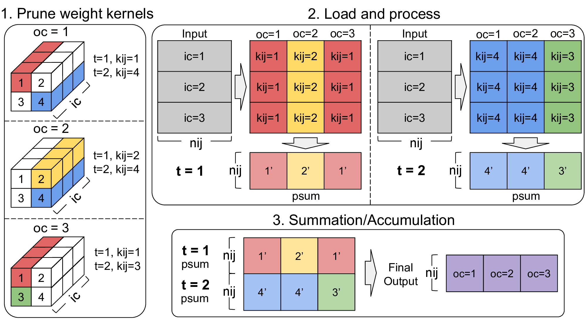

# Time-step Skipping Pruning and 4-bit Quantization for Systolic Arrays
PyTorch implementation of "timestep skipping" structured pruning of convolution layers, with 4-bit quantized-aware-training applied later. 

